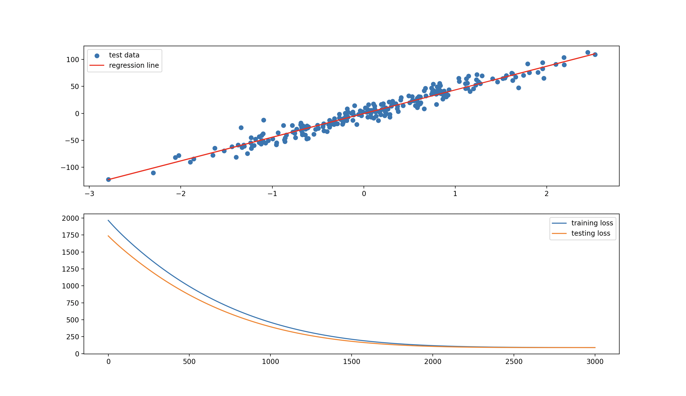
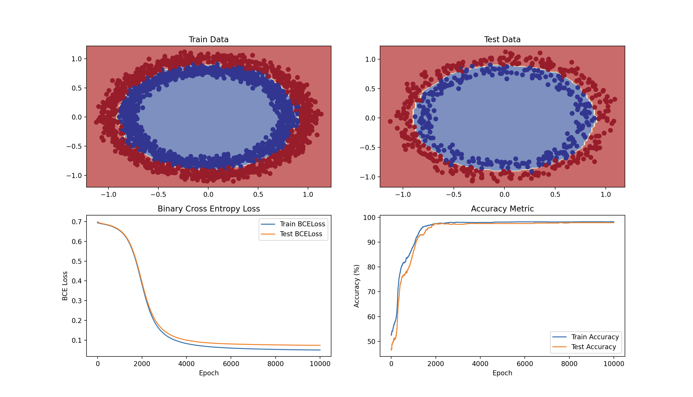
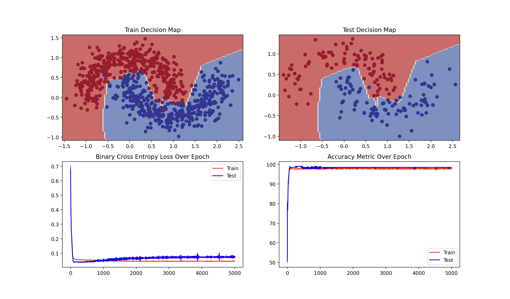
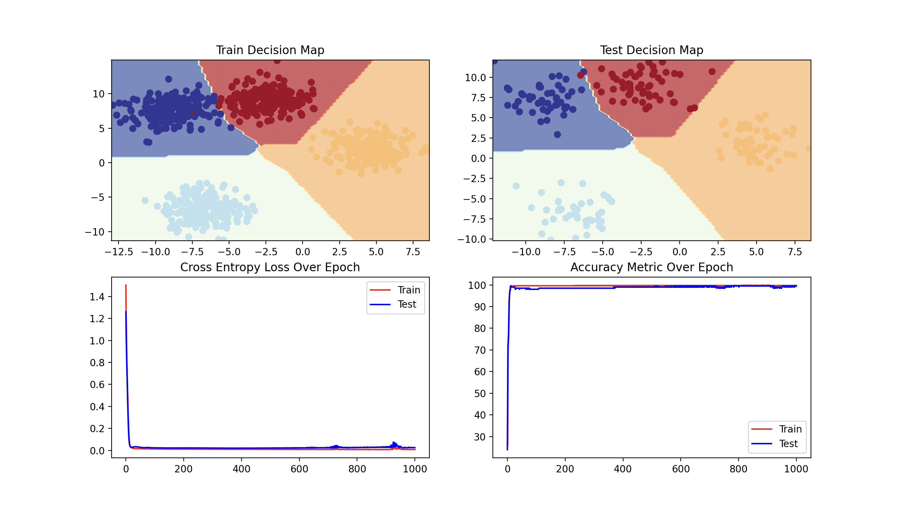
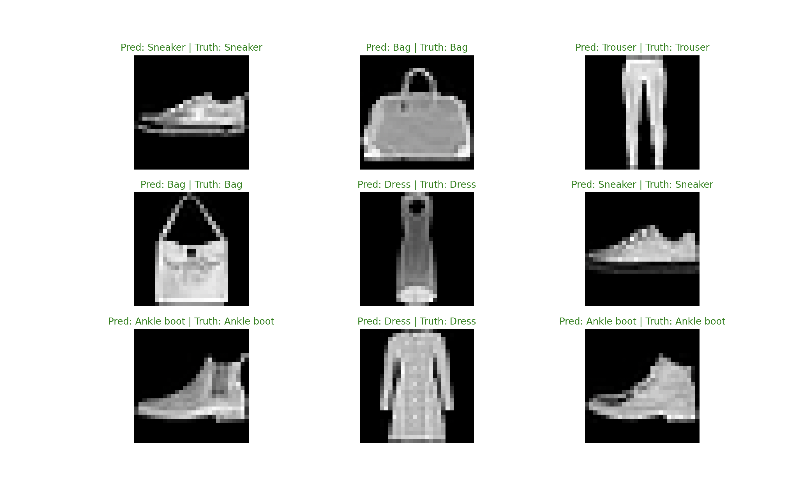

# Machine Learning Intro Projects with PyTorch
*Project made by Aiden Sands*

## Project One: Linear Regression
This problem comes from synthetic data that was produced using the Sci-kit Learn datasets library. Within the code of this project the number of epochs as well as various other hyperparameters can be tuned in order to see different results. A panel of the results is shown after the model has finished training and testing. The panel shown below shows the model performance after 100 epochs of training:

## Project Two: Circle Data Problem
This problem was the first in which I used a neural network to solve. The problem is binary classification in which there is no obvious way to differentiate using linearity. In the case where linearity can not be used to solve the problem, a neural network is used in order to search for other patterns that we can learn from. It was useful to first pass the data through three layers of neurons using linear activation functions. Following three linear layers I used a ReLU layer for the first time which was my use of a non-linear activation function. For more information on the ReLU function here is the [wiki](https://en.wikipedia.org/wiki/Rectifier_(neural_networks)) describing what it is. Here is the resulting panel on the binary classification problem, this panel includes a metric detailing running accuracy as well as running binary cross entropy loss. The training for this model ran for 10,000 epochs just for fun but never really experienced any overfitting somehow:

## Project Three: Crescent Moons Problem
This problem is very similar to the previous one in regards to the fact that it is also binary classification and cannot be solved using any sort of linearity and so requires some deep learning using a neural network. This was also the first project that I completed without needing any resources from the internet to help with remembering how to write some of the code. Below is the overall performance of the model using the same metrics as the prior project. This one trained over 5,000 epochs (once again for fun) and this time it did experience some overfitting which can be seen in the running loss curve:

## Project Four: Multi-Class Classification Problem
This project was largely the same as the other classification projects except for the fact that there were now more than two possible outputs. This problem just got me adjusted to building neural networks to output the desired number of predictions. This one trained for 1,000 epochs and really did not have any overfitting so I consider the length of training here to be pretty perfect. This was also the first change to using cross entropy loss rather than binary cross entropy loss:

## Project Five: Computer Vision with Convolution 
This project was the jump to convolutional neural networks and there is still much regarding the neural network and its functions that I do not quite understand just yet. However, This was the first model training that could take up to several minutes depending on the number of epochs. This was my first introduction to dataloaders as well as flattening layers, two dimensional convolution layers, and max pool 2D layers. The model as I have it currently performs quite well, its actual task is to look at low resolution images of clothing and be able to identify them based on the its training data. The data in question is the MNIST fashion dataset which can be accessed online. Since I implemented the training and testing loops into functions I was not able to figure out how to get a running metric on loss, accuracy, and decision boundary but I was able to show its predictive abilities in the plot below. The final training epoch yielded a training loss of 0.162 and a testing loss of 0.321 as well as a training accuracy of 94.06% and a testing accuracy of 90.11%:

